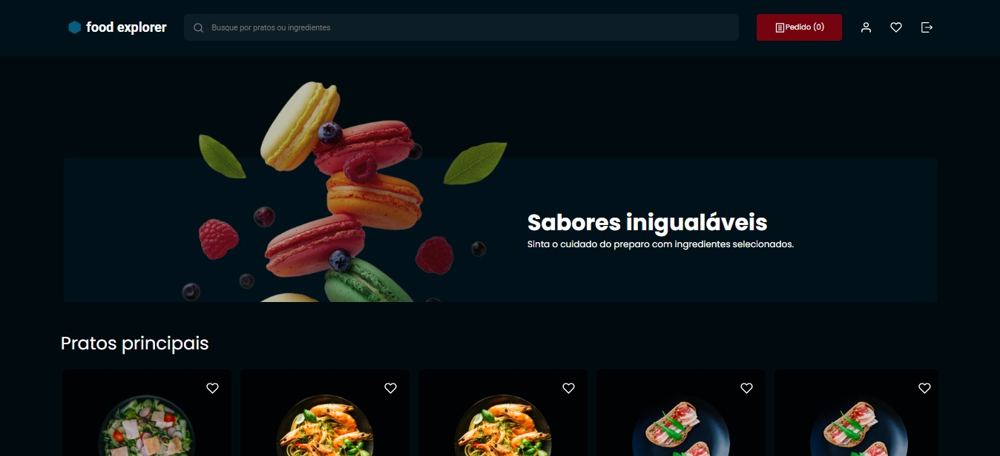
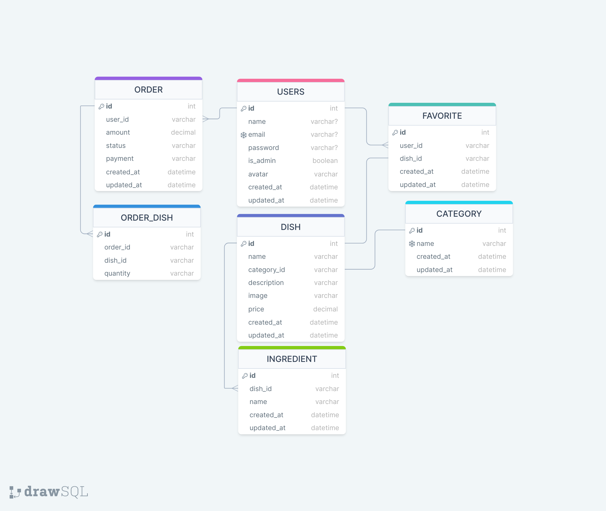

# 🍔Food Explorer - Backend

* Esse projeto é um cardápio digital para um restaurante fictício, conhecido como foodExplorer.

# 💬Sobre

Este é o backend do Desafio Final do programa Explorer da Rocketseat.

Essa aplicação simula um restaurante fictício, conhecido como FoodExplorer, onde usuários podem se cadastrar, logar e realizar pedidos.

os usuarios sao divididos em dois grupos cliente e adsministrador.

Sendo o usuário um Administrador, ele poderá adicionar pratos, ingredientes e atualizar pedidos.

Sendo o usuário um Cliente, ele poderá atualizar seu perfil, fazer um pedido, adicionar pratos a os favoritos.

# 🗄️DER do banco de dados:

# 📝Tecnologias

* JS - usado para fazer toda a lógica da aplicação;
* NodeJs - utilizado para executar o JS fora do navegador;
* Express - responsável por lidar com as requisições HTTP;
* Jest - utilizado para realizar testes de integração;
* Sqlite - usado para armazenar os dados;
* Knex - utilizado para gerar comandos SQL;
* Multe - usado para gerenciar o upload de imagens.
* Git - responsável por realizar o versionamento do código.

# 🔨Funcionalidades

* Mostrar todos pratos;
* Mostrar um prato especifico;
* Fazer a busca de um prato pelo nome;
* Adicionar ao carrinho;
* Visualizar o carrinho;
* Criar conta;
* Fazer login;
* Atualizar informações da conta;
* Adicionar um prato aos favoritos;
* Fazer um pedido;
* Ver a todos os seus pedidos;
* Ver os detalhes de um pedido especifico;
* Cadastrar um prato;
* Editar um prato;
* Editar a situação de um pedido;
* Visualizar todos os pedidos feitos por todos os clientes com filtro de data;

# 💡Utilização

#### Clone o projeto:
` 
git clone https://github.com/maycowjordny/food-explorer-backend.git
`

#### Entre no diretório:
` 
cd food-explorer-backend 
`

#### Instale as dependências:
` 
npm install 
`

#### Inicie o servidor local:
`
npm run dev 
`
`
npm run migrate
`
`
npm run seed 
`
#### Se tudo der certo, a seguinte mensagem vai aparecer no terminal/console:
 Server is running on port 3333. 

# 🔑Conta administrador:
* Email: 
`
admin@gmail.com
`
* senha: 
`
admin1
`

# Autor
Feito por Dev Maycow Jordny...Veja meu [LinkedIn](https://github.com/maycowjordny).
